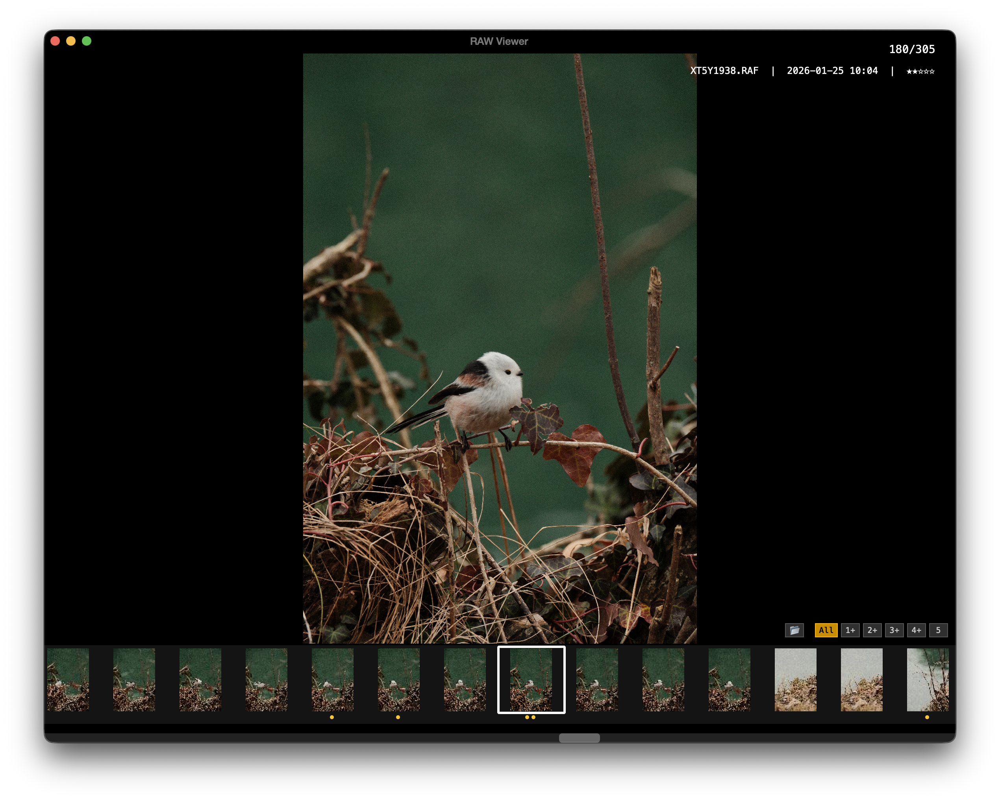

# RAW Viewer

Fast RAW image viewer for photo culling with Lightroom-compatible ratings.



## Download

Get the latest release from the [Releases](https://github.com/yannickpulver/raw-viewer/releases) page.

## Features

- Load RAW files from folder (recursive) or drag-drop
- Fast preview using embedded JPEGs
- Star ratings (0-5) saved to XMP sidecar files
- Filmstrip navigation
- Pinch-to-zoom, two-finger swipe navigation
- Filter by minimum rating
- Auto-update notifications

## Install

```bash
pip install -r requirements.txt
```

## Run

```bash
python main.py "/path/to/photos"
```

Or run without arguments to open folder picker.

## Build Executable

```bash
pip install pyinstaller
pyinstaller --onefile --windowed --name "RAW Viewer" main.py
```

Output: `dist/RAW Viewer.app`

## Shortcuts

| Key | Action |
|-----|--------|
| `←` `→` | Previous / Next image |
| `0-5` | Set rating (auto-advances) |
| `Cmd+0-5` | Filter by minimum rating |
| `F` | Jump to first image |
| `L` | Jump to last image |
| `R` | Jump to last rated image |
| `I` | Toggle info overlay |
| `O` | Open folder in Finder |
| `Cmd+S` | Toggle filmstrip |
| `Esc` | Close folder |
| `Cmd+Q` / `Cmd+W` | Quit |

Pinch trackpad to zoom, drag to pan. Scroll wheel on filmstrip to scroll horizontally.
