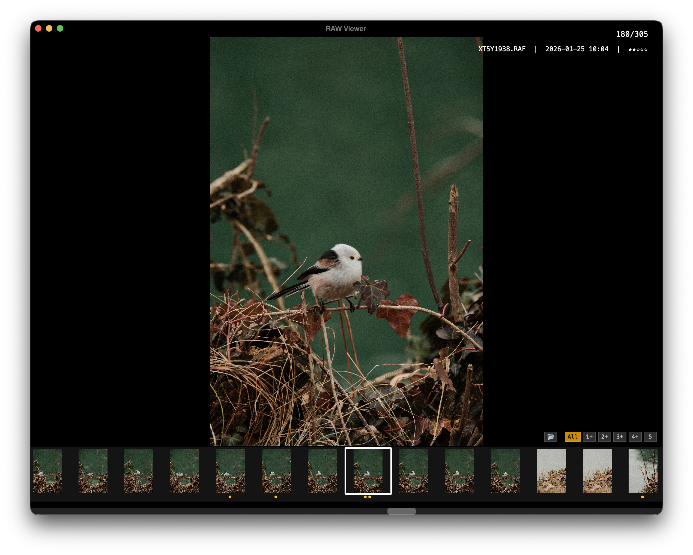

# RAW Viewer

Fast RAW image viewer for photo culling with Lightroom-compatible ratings and DaVinci Resolve integration.



## Install

```sh
brew install --cask yannickpulver/tap/raw-viewer
```

Or grab the latest build from the [Releases](https://github.com/yannickpulver/raw-viewer/releases) page.

## Features

- Load RAW files from folder (recursive) or drag-drop
- Fast preview using embedded JPEGs
- Star ratings (0-5) saved to XMP sidecar files
- Filmstrip navigation
- Pinch-to-zoom, two-finger swipe navigation
- Filter by minimum rating
- Video mode (MOV/MP4 playback)
- DaVinci Resolve export with rating metadata
- Auto-update notifications

## Development

```bash
pip install -r requirements.txt
python main.py "/path/to/photos"
```

Or run without arguments to open folder picker.

## Build Executable

```bash
pip install pyinstaller
pyinstaller --onefile --windowed --name "RAW Viewer" main.py
```

Output: `dist/RAW Viewer.app`

## Shortcuts

| Key | Action |
|-----|--------|
| `←` `→` | Previous / Next image |
| `0-5` | Set rating (auto-advances) |
| `Cmd+0-5` | Filter by minimum rating |
| `S` | Jump to first (start) |
| `E` | Jump to last (end) |
| `R` | Jump to last rated |
| `I` | Toggle info overlay |
| `H` | Toggle help overlay |
| `J` | Toggle JPEG mode |
| `M` | Toggle Video mode |
| `Space` | Play/Pause video |
| `O` | Reveal in Finder |
| `Cmd+L` | Open in Lightroom |
| `Cmd+D` | Export to DaVinci Resolve |
| `Cmd+S` | Toggle filmstrip |
| `Esc` | Close folder |
| `Cmd+Q` / `Cmd+W` | Quit |

Pinch to zoom, drag to pan, two-finger swipe to navigate. Scroll wheel on filmstrip.

## DaVinci Resolve Export

Press `Cmd+D` to export all visible files (respecting current filter) to DaVinci Resolve. Creates a project, imports media, and maps star ratings to clip colors:

| Rating | Clip Color | Keywords |
|--------|-----------|----------|
| 1★ | Blue | `1star` |
| 2★ | Teal | `2stars` |
| 3★ | Yellow | `3stars` |
| 4★ | Orange | `4stars` |
| 5★ | Green | `5stars,keeper` |

4-5★ clips are also marked as "Good Take". Requires **DaVinci Resolve Studio** (scripting API not available in free version).
